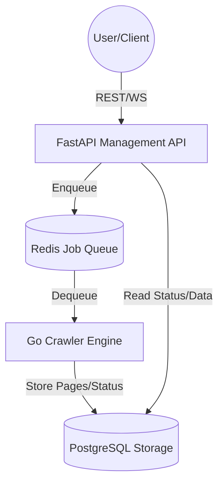
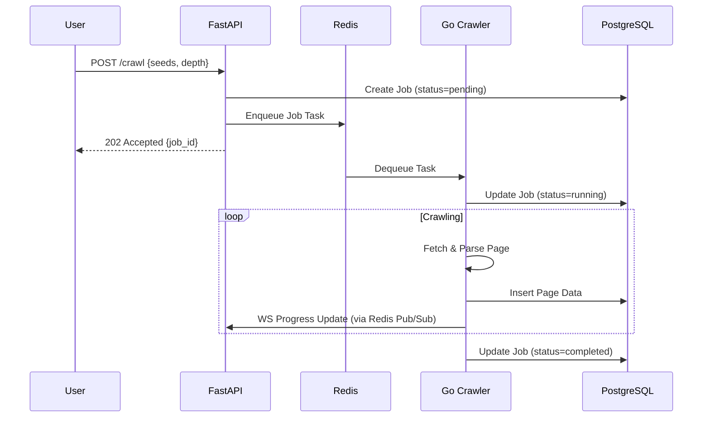

# System Architecture

This document describes the high-level architecture, data flow, and components of the Web Crawler system.

## Component Overview

The system consists of two primary services communicating via a Redis queue and sharing a PostgreSQL database for persistence.

### Components

1.  **FastAPI Management API (Python)**:
    -   Exposes REST endpoints for creating and managing crawl jobs.
    -   Provides real-time updates via WebSockets.
    -   Handles authentication and API key management.
    -   Communicates with Redis to enqueue jobs.

2.  **Go Crawler Engine (Go)**:
    -   A high-performance worker that consumes crawl jobs from Redis.
    -   Uses goroutines for concurrent page fetching.
    -   Implements politeness (robots.txt, rate limiting).
    -   Stores crawled content and metadata in PostgreSQL.

3.  **Redis (Job Queue)**:
    -   Acts as the message broker between the API and the Crawler.
    -   Decouples job submission from the crawling process.

4.  **PostgreSQL (Storage)**:
    -   The source of truth for crawl jobs, page data, and configuration.

## Data Flow (Crawl Job)

## Concurrency Model

-   **Go Crawler**: Uses a worker pool pattern. A dispatcher reads from the internal frontier and spawns/assigns work to a fixed number of worker goroutines. This ensures we don't overwhelm target servers or local resources.
-   **FastAPI**: Uses `asyncio` for non-blocking I/O, allowing it to handle many concurrent connections (REST and WebSocket) efficiently.
